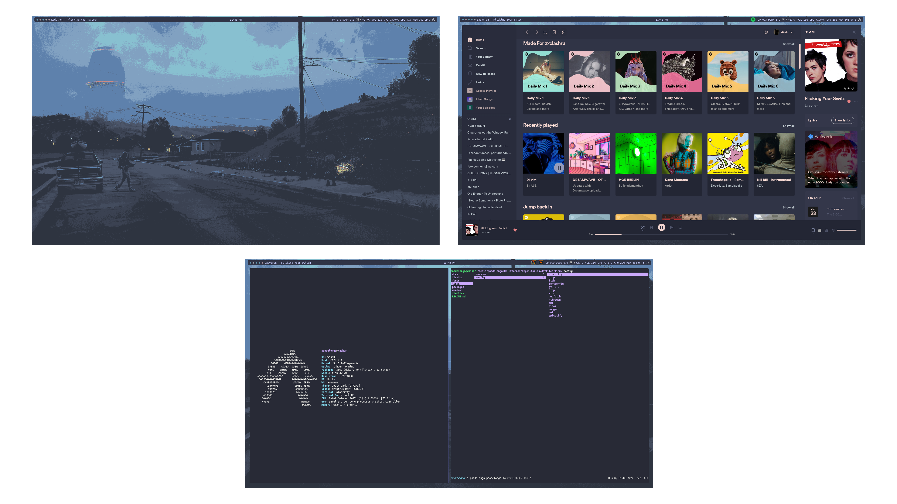

<!--
      ,~~.
     (  9 )-_,
(\___ )=="-"
 \ .   ) )
  \ `-" /
   `~j-"  
     ""=:
-->

---

# Dotfiles

My dotfiles

---

### Info

- **Distro**: [ZorinOS 16.2](https://zorin.com/os/)
- **Main Window Manager**: [Awesome WM](https://github.com/awesomeWM/awesome)
- **Shell**: [Fish Shell](https://github.com/fish-shell/fish-shell)
- **Theme**: [Qorgir Dark](https://github.com/vinceliuice/Qogir-theme)
- **Icons**: [Papirus Dark](https://github.com/PapirusDevelopmentTeam/papirus-icon-theme)
- **Font**: Hack Nerd Font
- **Terminal**: [Alacritty](https://github.com/alacritty/alacritty)
- **Terminal Editor**: [Micro Editor](https://github.com/zyedidia/micro)
- **IDE**: [Sublime Text 4](https://www.sublimetext.com/)

---

### Screenshot

